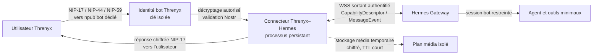

# Évaluation Hermes Agent Gateway × Threnyx

**Statut :** étude d’architecture, **aucune intégration active**. Ce document répond à une question de faisabilité ; il ne modifie ni les conversations Threnyx ni les clés d’utilisateur.

## Conclusion

**Oui, Threnyx peut être relié à Hermes**, mais comme **canal de bot explicitement appairé**, par un adaptateur serveur distinct. Il ne peut pas être transformé de façon sûre en simple « transport » transparent pour un Hermes hébergé ailleurs. Le gateway Hermes est un processus de fond durable qui normalise des événements de plateforme, maintient ses propres sessions et échange avec le connecteur via WebSocket.[1] La PWA Threnyx, servie en statique depuis GitHub Pages, ne peut pas héberger ce processus ni conserver sans risque les secrets de gateway.

Le mécanisme adapté est le **Hermes Relay Connector** : le gateway établit une connexion WebSocket sortante vers le connecteur, reçoit un descripteur de capacités et échange des `MessageEvent` normalisés et des actions sortantes.[2] Cependant, Hermes classe formellement ce contrat comme **expérimental** ; il peut évoluer sans cycle de dépréciation tant que deux plateformes de référence ne l’ont pas validé.[2] Il faut donc l’utiliser d’abord dans un pilote isolé, jamais comme une migration silencieuse du transport Threnyx.

| Question | Réponse précise |
|---|---|
| Peut-on connecter une application de messagerie personnalisée ? | **Oui**, par le contrat Relay ou, avec davantage de maintenance, par un adaptateur de plateforme Hermes dédié. |
| Peut-on tout faire depuis GitHub Pages ? | **Non.** Un connecteur et un gateway persistants côté serveur sont nécessaires. |
| Les messages restent-ils chiffrés jusqu’au bot ? | **Oui, dans une conversation dédiée au bot.** Le connecteur doit déchiffrer au nom de l’identité bot ; Hermes et son fournisseur de modèle voient alors le contenu autorisé. |
| Les conversations privées entre deux humains restent-elles inchangées ? | **Oui, si le pont est limité à une identité bot séparée.** Elles ne doivent jamais être copiées vers Hermes. |
| Images, fichiers et notes vocales ? | **Possibles, avec consentement par type**, mais le plan de médias Relay reste expérimental et limite actuellement chaque objet à 25 Mio.[3] |
| Appels audio/vidéo WebRTC ? | **Non pour le moment.** Le gateway gère des messages vocaux/TTS, pas un pont WebRTC de bout en bout pour les appels. |

## Architecture recommandée

La séparation importante est entre le **transport Threnyx** et l’**endpoint bot**. L’utilisateur échange avec une nouvelle identité Nostr de bot, par exemple `npub…hermes`, dont l’empreinte est vérifiable. Le connecteur n’obtient jamais la clé privée personnelle de l’utilisateur, son coffre Argon2id/WebAuthn, ses sauvegardes Constellation ni les clés de ses contacts humains.

> Threnyx n’offre pas aujourd’hui de forward secrecy démontrée. Brancher Hermes ne doit ni faire croire qu’elle existe, ni affaiblir les conversations existantes. Le bot forme un endpoint supplémentaire qui peut lire les contenus que l’utilisateur lui adresse volontairement.

## Parcours de connexion et validation

Le parcours doit être doublé : l’appairage Hermes autorise le gateway, tandis que l’appairage Threnyx prouve l’accord de l’utilisateur et fixe les permissions média.

| Étape | Mécanisme proposé | Propriété de sécurité |
|---|---|---|
| 1. Création du bot | Générer une paire secp256k1 Nostr exclusivement dédiée au bot, stockée dans un secret serveur ; publier sa clé publique et son fingerprint. | Aucune clé d’identité utilisateur ne quitte le coffre local. |
| 2. Démarrage d’appairage | Threnyx génère un QR `THX-HERMES1` contenant un nonce aléatoire de 256 bits, l’empreinte bot, une expiration courte et les permissions demandées. Le connecteur ne conserve que le hash du nonce. | Un QR capturé ne donne pas un accès durable ; il expire et ne peut être réutilisé. |
| 3. Confirmation Nostr | L’app envoie au bot un événement NIP-17 signé, chiffré pour le bot et lié au nonce, à la clé publique utilisateur et à son appareil. | Le serveur valide signature, destinataire, type, taille, expiration et anti-rejeu avant déchiffrement. |
| 4. Confirmation visible | Threnyx affiche l’identité bot et les permissions. L’utilisateur confirme explicitement texte, image, fichier et/ou transcription audio. | Pas de collecte implicite de conversations ni de médias. |
| 5. Mapping Hermes | Le connecteur transforme la clé publique Nostr en `user_id` stable et un identifiant de conversation dérivé par HMAC en `chat_id`, sans envoyer de libellé de contact ou de contenu de groupe dans la clé de session. | Réduction de fuite de métadonnées dans les journaux et sessions Hermes. |
| 6. Révocation | L’utilisateur retire le bot dans Threnyx ou utilise « Révoquer Hermes ». Le connecteur supprime les permissions, révoque le secret relay et purgera sessions/médias selon politique. | Révocation en plusieurs couches, avec arrêt des prochains événements. |

Le Relay Hermes authentifie le WebSocket avec un jeton Bearer HMAC à durée courte, dérivé d’un identifiant de gateway et d’un secret ; les secrets peuvent être vérifiés pendant une fenêtre de rotation.[4] Cette authentification protège le lien **connecteur ↔ gateway**, mais elle ne remplace ni la vérification Nostr des utilisateurs ni le consentement Threnyx.

## Flux de texte et contrôle d’autorisation

Le connecteur doit se comporter en **fail closed** : sans appairage vivant, aucun `MessageEvent` n’est envoyé à Hermes. Le champ `user_id` doit être la clé publique Nostr canonique de l’utilisateur ; le connecteur ne doit jamais faire confiance à un identifiant fourni dans une charge utile. Les identifiants d’événements Nostr, les nonces d’appairage et un journal de livraison idempotent doivent empêcher les rejouements et les doubles réponses.

Hermes applique bien par défaut un refus des utilisateurs non autorisés et propose listes d’autorisation ou pairing ; le connector Relay considère néanmoins l’autorisation comme « en amont ».[1] [5] Pour Threnyx, cela signifie que **le connecteur devient la frontière critique** : il doit imposer le consentement, les permissions et la relation `npub utilisateur → instance Hermes` avant toute livraison.

Le mode Hermes recommandé est `approvals.mode: manual`, sans `GATEWAY_ALLOW_ALL_USERS`, sans mode YOLO et avec une liste de commandes utilisateur très courte. La documentation Hermes précise que les protections de commande sont une défense en profondeur et non un sandbox contre un processus hostile ; l’agent doit donc s’exécuter dans un environnement dédié, à privilèges minimaux et sans accès au dépôt Threnyx ni aux secrets de production.[5]

## Médias : faisable, mais par accès explicite

Hermes Relay échange les médias **par référence**, jamais directement dans la trame WebSocket. Le gateway peut télécharger un média rehébergé, ou envoyer un fichier local au connecteur pour émission ultérieure ; ces routes sont protégées par le même Bearer que le WebSocket et plafonnées à 25 Mio dans l’implémentation actuelle.[3]

| Type | Parcours recommandé | Règle de confidentialité |
|---|---|---|
| Image | L’utilisateur envoie l’image au bot ; le connecteur déchiffre, chiffre temporairement au repos, puis l’expose uniquement au traitement vision explicitement demandé. | Ne jamais analyser automatiquement les images de conversations humaines. TTL court et suppression après livraison. |
| Fichier | Passage autorisé seulement pour une liste MIME, une taille et un scan de type réels ; ne jamais exécuter, prévisualiser dans un sandbox, ou réinjecter automatiquement dans des outils. | Les fichiers peuvent contenir une injection de prompt ou du contenu malveillant. |
| Vocal | L’utilisateur choisit « Transcrire pour Hermes » ; le connecteur déchiffre et transmet le fichier temporaire au flux de transcription. | Pas d’écoute permanente, pas de capture d’appel, indication visible de l’envoi au bot. |
| Réponse audio | Hermes produit un fichier local ; le connecteur le récupère, le chiffre pour la clé utilisateur et l’envoie comme média Threnyx. | Le fournisseur TTS et le serveur voient le texte généré selon la configuration choisie. |
| Fichier > 25 Mio | Reste hors du bridge Hermes ou passe par un mécanisme de partage Threnyx distinct, consentement renouvelé. | Ne pas contourner la limite en fragmentant silencieusement. |

Les URLs de médias Relay ne doivent jamais être des liens publics Nostr. Elles doivent être opaques, liées à l’instance appairée, servies par HTTPS, à durée de vie courte, sans référencement, avec contrôle MIME/octet size avant lecture. Les blobs originaux Threnyx doivent rester chiffrés ; seul le contenu destiné au bot peut être déchiffré temporairement dans un espace chiffré au repos.

## Appels : hors périmètre du premier connecteur

WebRTC Threnyx chiffre les pistes par DTLS-SRTP mais expose déjà des métadonnées réseau selon STUN/TURN et le pair. Faire entrer Hermes dans un appel exigerait un troisième participant média ou un enregistreur, ce qui annulerait la promesse de pair-à-pair et créerait une nouvelle surface très sensible. Hermes documente les notes vocales, la transcription et le TTS sur les plateformes, pas un pont d’appel WebRTC chiffré de bout en bout.[1]

Le pilote doit donc refuser toute demande de participation automatique aux appels. À terme, un assistant d’appel ne pourrait être envisagé qu’avec **consentement des deux participants**, indicateur permanent, clé média séparée, politique de conservation nulle et audit indépendant.

## Plan de pilote sûr

| Phase | Portée | Critère de sortie |
|---|---|---|
| P0 — Contrat | Simulateur de `MessageEvent`, handshake Relay, tests de conformité du descriptor et de session-key. | Tests de rejet : événement non signé, mauvais destinataire, nonce expiré, replay, surdimensionnement. |
| P1 — Texte | Une identité bot, une conversation 1:1 opt-in, aucun outil Hermes sensible, aucun média. | Émission/réception NIP-17, reprise après redémarrage, révocation testée. |
| P2 — Médias | Images puis audio opt-in, taille ≤ 25 Mio, TTL et chiffrement temporaire. | Tests MIME, antivirus/sandbox selon type, purge vérifiée, aucune URL publique. |
| P3 — Outils | Capacité Hermes minimale et approbation manuelle pour toute action à effet externe. | Test d’injection de prompt dans texte/fichier et preuve de refus des actions non approuvées. |
| P4 — Évaluation | Revue de code externe, revue du contrat Relay, tests de charge et incident response. | Décision explicite de passage pilote, conservation des avertissements expérimentaux. |

## Décision recommandée

La connexion est **techniquement faisable**, mais pas encore une fonctionnalité à activer dans l’application grand public. Le bon premier objectif est un bot Threnyx–Hermes volontairement séparé, hébergé dans un service persistant, avec texte opt-in seulement. La connexion Relay doit être traitée comme un protocole expérimental dépendant d’une version Hermes épinglée et de tests de contrat.

Il ne faut pas : importer les clés privées des utilisateurs sur le serveur, connecter des conversations humaines existantes, faire transiter les appels WebRTC, activer tous les fichiers/médias par défaut, exposer un webhook public non authentifié, ni employer `GATEWAY_ALLOW_ALL_USERS` ou le mode YOLO.

## Références

[1] [Hermes Agent — Messaging Gateway](https://hermes-agent.nousresearch.com/docs/user-guide/messaging/)

[2] [Hermes Agent — Gateway Internals](https://hermes-agent.nousresearch.com/docs/developer-guide/gateway-internals)

[3] [Hermes Agent — Relay media client](https://github.com/NousResearch/hermes-agent/blob/main/gateway/relay/media.py)

[4] [Hermes Agent — Relay authentication primitives](https://github.com/NousResearch/hermes-agent/blob/main/gateway/relay/auth.py)

[5] [Hermes Agent — Security](https://hermes-agent.nousresearch.com/docs/user-guide/security)
